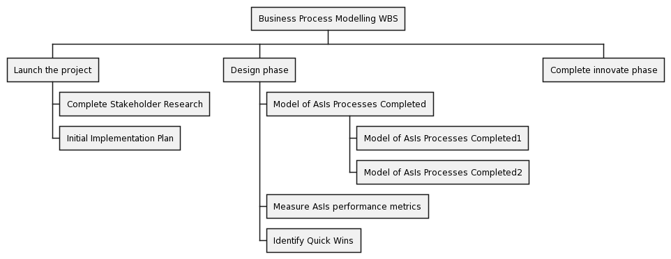
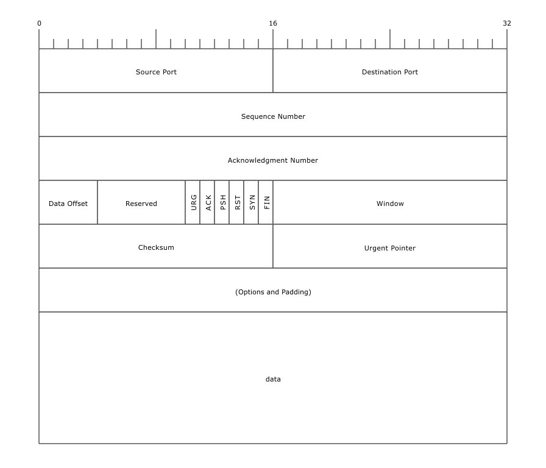
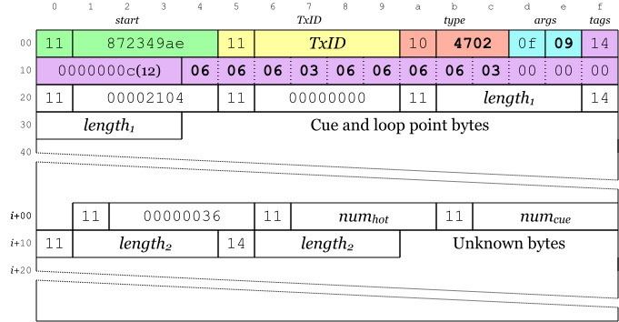
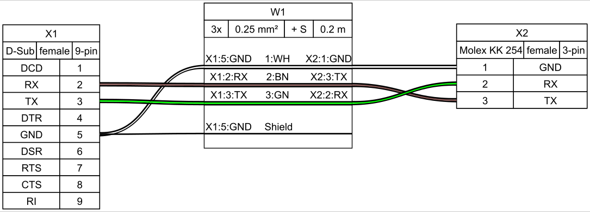
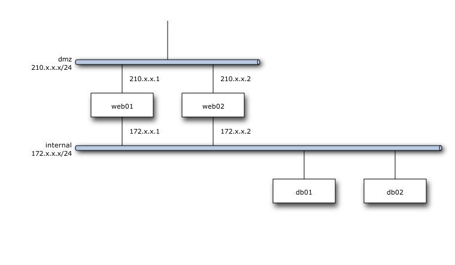
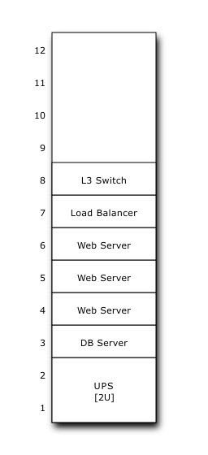
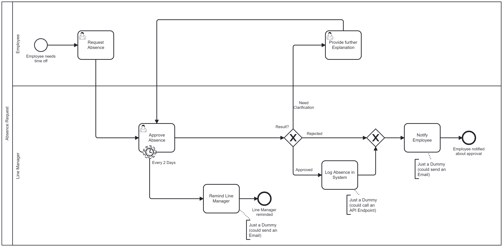
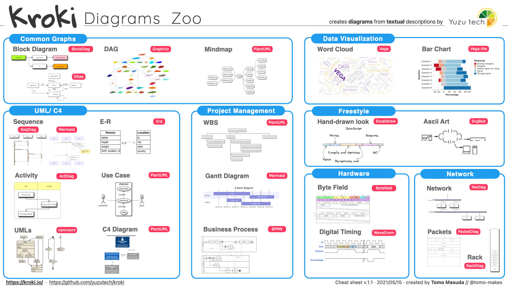

<!-- theme: gaia -->
<!-- theme: default-->

Architecture Guide - Diagrams
===


### Diagrams as code

####  Mark Bacon, Feb 2023

---
Mermaid - Sequence Diagram
===
``` 
sequenceDiagram
  autonumber
  box lightgreen Alice and John
    actor Alice
    participant John
  end
  Note over Alice,John: A typical interaction<br/>But now in two lines
  Alice->John: Hello John, how are you?
  rect rgb(191, 223, 255)
    loop Every minute
      John-->Alice: Great!
    end
    alt is sick
        Bob->>Alice: Not so good :(
    else is well
        Bob->>Alice: Feeling fresh like a daisy
    end
    opt Extra response
        Bob->>Alice: Thanks for asking
    end
  end
```


---
Mermaid - Flow Chart
===
```
flowchart TB
    A[Start] --Some text--> B(Continue)
    B --> C{Evaluate}
    C -- One --> D[Option 1]
    C -- Two --> E[Option 2]
    C -- Three --> F[fa:fa-car Option 3]
```


---
Mermaid - Class
===

```
classDiagram
    Animal <|-- Duck
    Animal <|-- Fish
    Animal <|-- Zebra
    Animal : +int age
    Animal : +String gender
    Animal: +isMammal()
    Animal: +mate()
    class Duck{
      +String beakColor
      +swim()
      +quack()
    }
    class Fish{
      -int sizeInFeet
      -canEat()
    }
    class Zebra{
      +bool is_wild
      +run()
    }
```


---
Mermaid - State
===
```
stateDiagram
    [*] --> Still
    Still --> [*]
    Still --> Moving
    Moving --> Still
    Moving --> Crash
    Crash --> [*]
```


---
Mermaid - Gantt
===
```
gant
    title A Gantt Diagram
    dateFormat  YYYY-MM-DD
    section Section
    A task           :a1, 2014-01-01, 30d
    Another task     :after a1  , 20d
    section Another
    Task in sec      :2014-01-12  , 12d
    another task      : 24d
```


---
Mermaid - Mindmap
===
```
mindmap
  root((mindmap))
    Origins
      Long history
      ::icon(fa fa-book)
      Popularization
        British popular psychology author Tony Buzan
    Research
      On effectiveness<br/>and features
      On Automatic creation
        Uses
            Creative techniques
            Strategic planning
            Argument mapping
    Tools
      Pen and paper
      Mermaid
```


---
Mermaid - User Journey
===
```
journey
    title My working day
    section Go to work
      Make tea: 5: Me
      Go upstairs: 3: Me
      Do work: 1: Me, Cat
    section Go home
      Go downstairs: 5: Me
      Sit down: 5: Me
```


---
Mermaid - Git Graph
===
```
gitGraph
  commit id: "1"
  commit id: "2"
  branch develop
  checkout develop
  commit id: "3"
  commit id: "4"
  checkout main
  merge develop id: "5" tag: "v1.0"
  checkout develop
  commit id: "6"
  branch feature-A
  checkout feature-A
  commit id: "7"
  checkout develop
  commit id: "8"
  checkout main
  merge feature-A id: "9" tag: "v1.1"
  checkout develop
  commit id: "10"
  branch release-1.0
  checkout release-1.0
  commit id: "11"
  checkout main
  merge release-1.0 id: "12" tag: "v1.0.1"
  checkout develop
  merge release-1.0 id: "13"
  commit id: "14"
  branch hotfix-1.0.2
  checkout hotfix-1.0.2
  commit id: "15"
  checkout main
  merge hotfix-1.0.2 id: "16" tag: "v1.0.2"
  checkout develop
  merge hotfix-1.0.2 id: "17"
  commit id: "18"
```


---
PlantUML - WBS
===
```
@startwbs
* Business Process Modelling WBS
** Launch the project
*** Complete Stakeholder Research
*** Initial Implementation Plan
** Design phase
*** Model of AsIs Processes Completed
**** Model of AsIs Processes Completed1
**** Model of AsIs Processes Completed2
*** Measure AsIs performance metrics
*** Identify Quick Wins
** Complete innovate phase
@endwbs
```



---
PacketDiag
===
```
packetdiag {
  colwidth = 32;
  node_height = 72;

  0-15: Source Port;
  16-31: Destination Port;
  32-63: Sequence Number;
  64-95: Acknowledgment Number;
  96-99: Data Offset;
  100-105: Reserved;
  106: URG [rotate = 270];
  107: ACK [rotate = 270];
  108: PSH [rotate = 270];
  109: RST [rotate = 270];
  110: SYN [rotate = 270];
  111: FIN [rotate = 270];
  112-127: Window;
  128-143: Checksum;
  144-159: Urgent Pointer;
  160-191: (Options and Padding);
  192-223: data [colheight = 3];
}
```


---
Bytefield
==
```
(defattrs :bg-green {:fill "#a0ffa0"})
(defattrs :bg-yellow {:fill "#ffffa0"})
(defattrs :bg-pink {:fill "#ffb0a0"})
(defattrs :bg-cyan {:fill "#a0fafa"})
(defattrs :bg-purple {:fill "#e4b5f7"})

(defn draw-group-label-header
  [span label]
  (draw-box (text label [:math {:font-size 12}]) {:span span :borders #{} :height 14}))

(defn draw-remotedb-header
  [kind args]
  (draw-column-headers)
  (draw-group-label-header 5 "start")
  (draw-group-label-header 5 "TxID")
  (draw-group-label-header 3 "type")
  (draw-group-label-header 2 "args")
  (draw-group-label-header 1 "tags")
  (next-row 18)

  (draw-box 0x11 :bg-green)
  (draw-box 0x872349ae [{:span 4} :bg-green])
  (draw-box 0x11 :bg-yellow)
  (draw-box (text "TxID" :math) [{:span 4} :bg-yellow])
  (draw-box 0x10 :bg-pink)
  (draw-box (hex-text kind 4 :bold) [{:span 2} :bg-pink])
  (draw-box 0x0f :bg-cyan)
  (draw-box (hex-text args 2 :bold) :bg-cyan)
  (draw-box 0x14 :bg-purple)

  (draw-box (text "0000000c" :hex [[:plain {:font-weight "light" :font-size 16}] " (12)"]) [{:span 4} :bg-purple])
  (draw-box (hex-text 6 2 :bold) [:box-first :bg-purple])
  (doseq [val [6 6 3 6 6 6 6 3]]
    (draw-box (hex-text val 2 :bold) [:box-related :bg-purple]))
  (doseq [val [0 0]]
    (draw-box val [:box-related :bg-purple]))
  (draw-box 0 [:box-last :bg-purple]))

(draw-remotedb-header 0x4702 9)

(draw-box 0x11)
(draw-box 0x2104 {:span 4})
(draw-box 0x11)
(draw-box 0 {:span 4})
(draw-box 0x11)
(draw-box (text "length" [:math] [:sub 1]) {:span 4})
(draw-box 0x14)

(draw-box (text "length" [:math] [:sub 1]) {:span 4})
(draw-gap "Cue and loop point bytes")

(draw-box nil :box-below)
(draw-box 0x11)
(draw-box 0x36 {:span 4})
(draw-box 0x11)
(draw-box (text "num" [:math] [:sub "hot"]) {:span 4})
(draw-box 0x11)
(draw-box (text "num" [:math] [:sub "cue"]) {:span 4})

(draw-box 0x11)
(draw-box (text "length" [:math] [:sub 2]) {:span 4})
(draw-box 0x14)
(draw-box (text "length" [:math] [:sub 2]) {:span 4})
(draw-gap "Unknown bytes" {:min-label-columns 6})
(draw-bottom)
```


---
WireViz
===
```
connectors:
  X1:
    type: D-Sub
    subtype: female
    pinlabels: [DCD, RX, TX, DTR, GND, DSR, RTS, CTS, RI]
  X2:
    type: Molex KK 254
    subtype: female
    pinlabels: [GND, RX, TX]

cables:
  W1:
    gauge: 0.25 mm2
    length: 0.2
    color_code: DIN
    wirecount: 3
    shield: true

connections:
  -
    - X1: [5,2,3]
    - W1: [1,2,3]
    - X2: [1,3,2]
  -
    - X1: 5
    - W1: s
```


---
NwDiag
===
```
nwdiag {
  network dmz {
    address = "210.x.x.x/24"

    web01 [address = "210.x.x.1"];
    web02 [address = "210.x.x.2"];
  }
  network internal {
    address = "172.x.x.x/24";

    web01 [address = "172.x.x.1"];
    web02 [address = "172.x.x.2"];
    db01;
    db02;
  }
}
```


---
RackDiag
===
```
rackdiag {
  12U;
  1: UPS [2U];
  3: DB Server;
  4: Web Server;
  5: Web Server;
  6: Web Server;
  7: Load Balancer;
  8: L3 Switch;
}
```


---
BPMN - Using Camunda
===
- Defined in xml (BPMN xml standard
- )


---
Appendix Diagrams
====

---